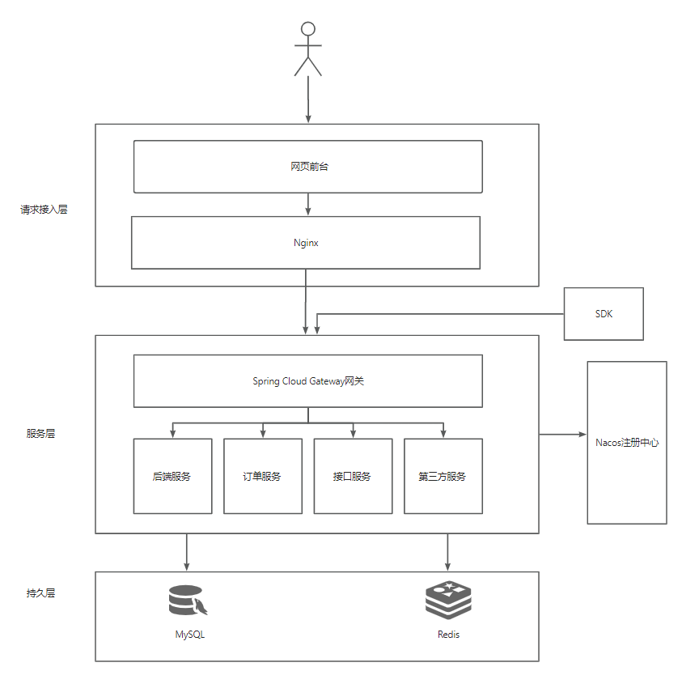

# 迅捷API开放调用平台

> 项目还在不断完善优化中...

迅捷API开放调用平台是一个基于 React、Spring Boot、Dubbo 和 Gateway 构建的API接口开放平台。它提供了管理员接入和发布接口、可视化接口调用情况的功能，同时也允许用户开通接口调用权限、浏览接口及在线调试，并通过客户端SDK轻松调用接口。

## 功能特点

- **管理员功能：**
    - 接入和发布接口：管理员可以轻松接入新的接口，并将其发布到平台供用户调用。
    - 可视化接口调用情况：管理员可以查看各接口的调用情况，包括调用次数、成功率等统计信息。

- **用户功能：**
    - 开通接口调用权限：用户可以申请开通需要调用的接口权限。（待开发，默认全部都可调用
    - 浏览接口：用户可以浏览平台上已经接入的接口列表，并查看相关文档。
    - 在线调试：用户可以在平台上进行接口调试，验证接口的正确性和返回结果。
    - 客户端SDK支持：平台提供客户端SDK，用户可以轻松集成到自己的应用中，快速调用接口。

## 技术栈

### 前端技术栈

- 开发框架：React、Umi
- 脚手架：Ant Design Pro
- 组件库：Ant Design、Ant Design Components
- 语法扩展：TypeScript、Less
- 打包工具：Webpack
- 代码规范：ESLint、StyleLint、Prettier

### 后端技术栈

- 主语言：Java
- 框架：SpringBoot 2.7.0、Mybatis-plus、Spring Cloud
- 数据库：Mysql8.0、Redis
- 中间件：RabbitMQ（还未引入）
- 注册中心：Nacos
- 服务调用：Dubbo
- 网关：Spring Cloud Gateway

- 负载均衡：Spring cloud Loadbalancer（还未引入）

## 功能模块

已完成 (✔)
未完成 (✘)

- 用户、管理员
    - 登录注册 (✔)
        - 短信验证 (✔)
    - 个人主页 (✘)
    - 设置个人信息（🚀，因为用户信息模块并不是本项目重点，优先级较后 (✘)
    - 管理员：接口管理  (✔)
    - 管理员：接口分析、订单分析   (✔)
    - 管理员：接口审核（🚀）(✔)
- 接口
    - 浏览接口信息  (✔)
    - 在线调用接口  (✔)
    - 接口搜索 (✘)
    - 购买接口 (✘)
    - 下载SDK调用接口 (✘)
- 订单
    - 创建订单 (✘)
    - 支付宝沙箱支付 (✘)

#### 后端模块

- xunjieapi-backend：后端服务，提供用户、接口等基本操作
- xunjieapi-common：项目公共模块，包含一些公用的实体类，远程调用接口
- xunjieapi-gateway：api网关，整个后端的入口，作服务转发、用户鉴权、统一日志、服务接口调用计数
- xunjieapi-interface：平台提供的接口服务，目前只有简单的几个接口，大家可以自行拓展
- xunjieapi-client-sdk：提供给开发者的SDK

## 系统架构
> 仅供参考

